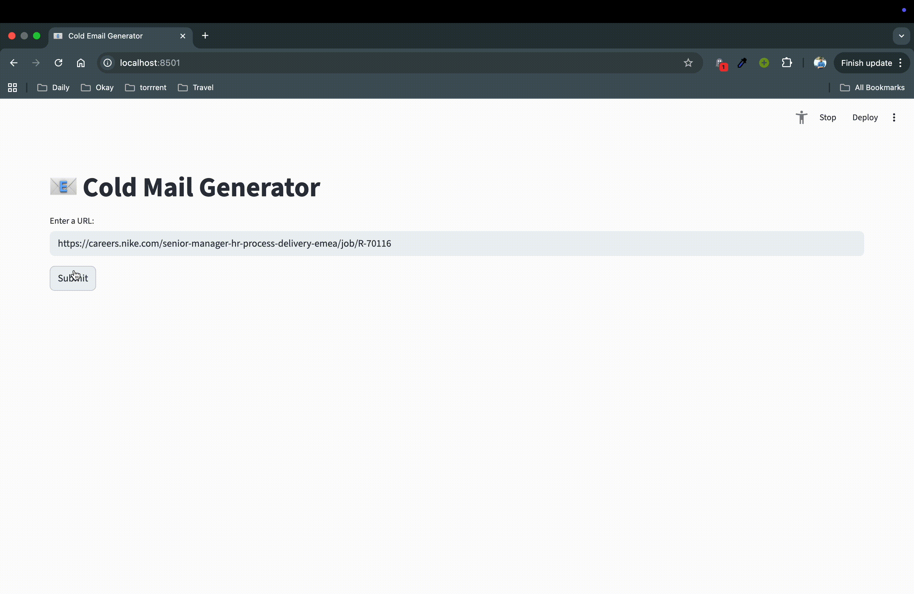

📩 COLD MAIL GENERATOR
<br>
Cold email generator built with Groq, LangChain, and Streamlit — scrapes job postings from career pages and generates personalized outreach emails with relevant portfolio links.

🔹 Detailed Repo Description

This tool automates the creation of cold emails for service-based companies. By entering a careers page URL, it extracts job listings and uses a vector database to match and insert relevant portfolio projects. The system then crafts tailored outreach emails, helping business development teams pitch their services more effectively.

For instance, if Nike is hiring a Principal Software Engineer, instead of going through costly recruitment, a company like Atliq can propose a dedicated engineer. A business development executive (e.g., Mohan) can use this tool to generate a personalized cold email showcasing Atliq’s expertise instantly.



SET UP 

 1) To get started, we first need to get an API_KEY. Inside app/.env update the value of OPENAI_API_KEY with the API_KEY you created.

 2) To get started, first install the dependencies using:
```
 pip install -r requirements.txt
```
 3) Run the streamlit app:
```
streamlit run app/main.py
```

Copyright (C) RUBAL-MB Inc. All rights reserved.

Additional Terms: This software is licensed under the MIT License. However, commercial use of this software is strictly prohibited without prior written permission from the author. Attribution must be given in all copies or substantial portions of the software.
